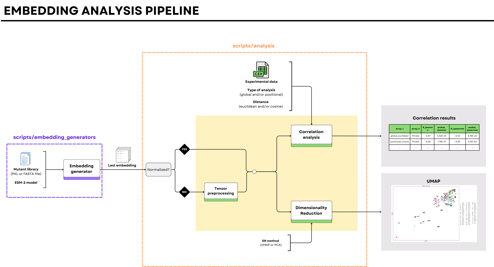

# ESM-2 embedding analysis

This pipeline implemented in Python allows you to perform two different analyses of the last hidden state from ESM-2 model results: Correlation and DimensionalityReduction. To run it you just need to define a `config.json` that contains all the necessary parameters.





## 1. Installation

1.1. Clone the repository

```bash
git clone https://github.com/sarata00/esm_analyzer.git
```       

1.2. Create a conda environment and install all the dependencies

## 2. How to use it?

| Arguments           | Description                                                                | Type    |
| ------------------- | -------------------------------------------------------------------------- | ------- |
| \-c, \-\-config_file      | Configuration file. Default: None | string  |
| \-v, \-\-verbose    | Shows messages to follow the process execution. Default: True              | boolean |

### 2.1. What is inside *config* file?
This file contains all the variables used in our analyses. There are common arguments in both type of analysis:

| Arguments | Description                                                           
| ------------------- | -------------------------------------------------------------------------- | 
| path_to_tensor      | Path to the embedding tensor 
| mutated_sequence   | This is the sequence we mutate in our *in silico* DMS experiment             |
should_preprocess | Just to indicate if we need to preprocess our embedding data in case this is not normalized. Type: bool |
output_path | Where you want to save the results |

Then, for **Correlation analysis** we have some specific arguments:

| Arguments | Description                                                           
| ------------------- | -------------------------------------------------------------------------- | 
| experimental_data      | Path to the experimental dataframe to which we want to compare our model data with
| analysis   | Type of analysis: global and/or positional. It could be both. **Type: list**          |
distance | Type of distance used to calculate the differences between variants and wildtype sequence (euclidean and/or cosine). It could be both. **Type: list** |

Finally, for the **Dimensionality reduction** analysis we have just one argument:

| Arguments | Description                                                           
| ------------------- | -------------------------------------------------------------------------- | 
| method      | Kind of dimensionality reduction approach: UMAP or PCA |

Take into account that in the `data` folder there is no tensor file, due to storage limits. So, you will need to create it using `embedding_generators` functions. 

Let me give you an example!


## 3. Example

The first step is to generate the embedding tensors. For that, you can use both scripts: `embedding_generators/embedding_generator_esm2` and `embedding_generators/tensor_generator_hugging_face` depending if you want to use ESM-2 or HugginFace configuration, respectively. 

```bash 
# Using ESM-2 modules
python embedding_generators/embedding_generator_esm2 -i mutant_library.fasta -m "esm2_t36_3B_UR50D" -o path/to/output -norm True
        # - norm = True in case you want to normalize the embedding dimensions

# Using HuggingFace modules
python embedding_generators/embedding_generator_hugging_face -i mutant_library.fasta -m "facebook/esm2_t36_3B_UR50D" -o path/to/output

```

The following step is the analysis of the results. These embeddings (normalized or not) can be processed and analyzed by using `analysis` module. Finally, the results are stored in `results` folder.

> Notice that the "path/to/output" has to be the same path than the "path_to_tensor" in the json file!


### Correlation analysis
In the repository folder:
```bash
python scripts/analysis -c config/config_corr_1.json
```
As a result, we obtain three dataframes: 
- df_correlation: where we will find the correlation analysis between the experimental data ("fitness" column) and the processed model data (according to the type of analysis - global or positional- and distance - euclidean or cosine.)
- df_meanPos_corr: correlation analysis results by mean Position analysis. This means that the results show the mean distance of the variant embeddings at a given position to the wildtype embedding.
- df_model_exp: where we merge both experimental and model data.

### Dimensionality reduction analysis
In the repository folder:

```bash
python scripts/analysis -c config/config_dr_1.json
```
As a result, we will obtain a figure (in svg format) of the analysis plot. 


## Next steps:
1. Merge both embedding_generator and analyzer.
2. Add logits analysis